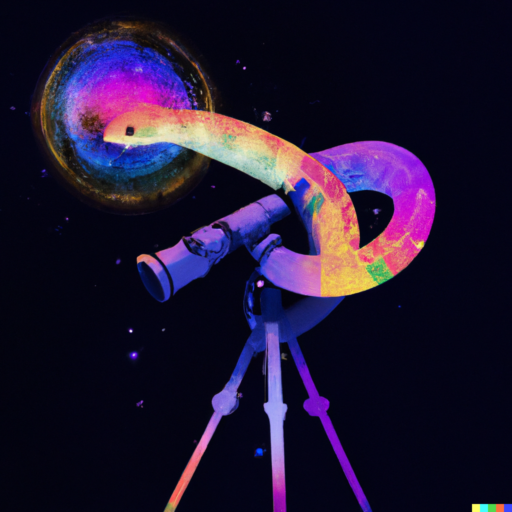

  

Welcome to nirHiss, a data reduction routine for the curviest JWST
instrument! Here, you'll find all kinds of tricks to extracting high-precision
NIRISS light curves (and subsequently transmission spectra)!

For installation, you can grab the latest release from PyPI by doing:

        pip install nirhiss

or you can the latest development version by doing:

        git clone https://github.com/afeinstein20/nirhiss
        cd eleanor
        python setup.py install

ADF_extracted_stellar_spectra
  - F277W filter from the median image, then gaussian filtered to smooth
    any noise
  - Removing cosmic rays and interpolating over
  - Using the 2D modeled background to get rid of 1/f noise
  - Subtracting the median from each column

ADF_extracted_stellar_spectra_method2
  - F277W filter from the median image, but only using the high outliers so
    it captures the 0th order effects and not any noise in the image
  - DQ masked and interpolated pixels
  - Using the SUBSTRIP256 model background provided on JDox
  - Removing cosmic rays and interpolating over
  - Removing bad integrations (5 in total)
  - No additional background modeling

ADF_extracted_stellar_spectra_method3
  - F277W filter from the median image, then gaussian filtered to smooth
    any noise
  - DQ masked and interpolated pixels
  - Using the SUBSTRIP256 model background provided on JDOX
  - Removing cosmic rays and interpolating over

ADF_extracted_stellar_spectra_method4
  - F277W filter from the median image, but only using the high outliers so
    it captures the 0th order effects and not any noise in the image
  - DQ masked and interpolated pixels
  - Using the SUBSTRIP256 model background provided on JDox
  - Removing cosmic rays and interpolating over
  - Minor additional background correction (only looking at pixels <1.8 sigma),
    interpolating, and smoothing with a Gaussian filter

# WASP-39b data set

ADF_extracted_wasp39_full_v5
  - F277W filter from the median image, sigma clipped to isolate the 0th order
    sources, then gaussian filtered to smooth any noise
    -  Scaling to 2 different sources and taking the median
  - DQ masked and interpolated pixels
  - Scaling the SUBSTRIP256 model background provided on JDox
  - 1/f noise correction via Néstor's routine (no mask)
  - Removing cosmic rays and interpolating over those pixels
  - Minor additional background correction, interpolating, taking a median
    of all the models, and smoothing with a Gaussian filter
  - Decreased box mask size for Orders 1 and 2 to 24 pixels each (diameter)
